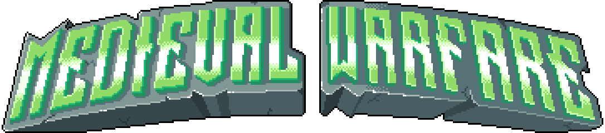

## Presentation

_Medieval Warfare_ is a side-scrolling shoot 'em up game.

In this video game, you progress through a linear level, facing a multitude of enemies before ultimately confronting a boss.
Along the way, you can collect gold coins, allowing you to upgrade your gear by purchasing various types of runes.

The game is set in a dark-medieval-futuristic-fantasy universe, featuring a pixel art style. It is playable on PC (Windows, Linux, and MacOS) using keyboard/mouse.

Whether you're nostalgic for classic arcade games or looking for challenge, we're confident that Medieval Warfare will provide an enjoyable gaming experience!

## Context

Project made during the 5th semester at IMAC engineering school.

## Controls

| Action        | Key/Button     |
|---------------|----------------|
| Jump          | <kbd>Z</kbd>   |
| Crouch        | <kbd>S</kbd>   |
| Move Left     | <kbd>Q</kbd>   |
| Move Right    | <kbd>D</kbd>   |
| Aim           | Mouse Cursor   |
| Pause         | <kbd>P</kbd>   |
| Navigation    | Mouse (Left click, Scroll) |

## Screenshots

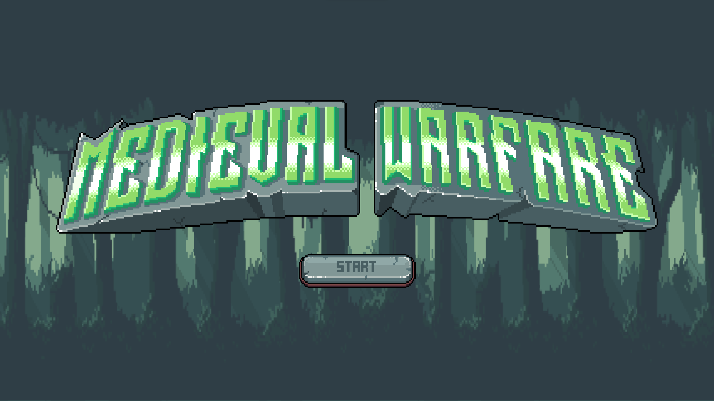
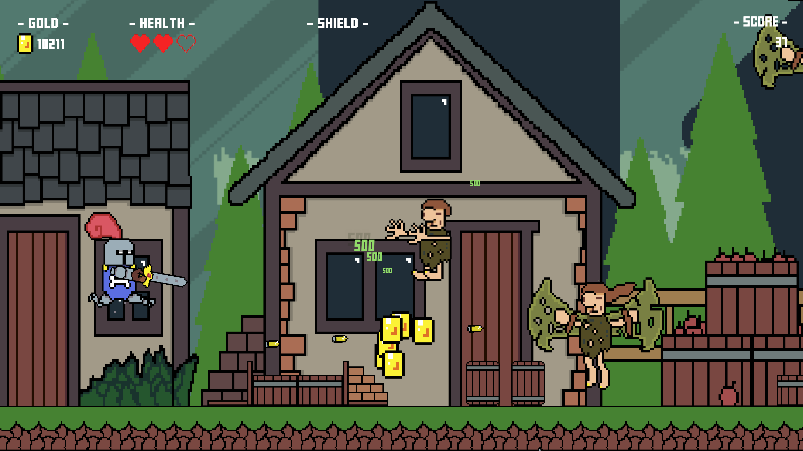
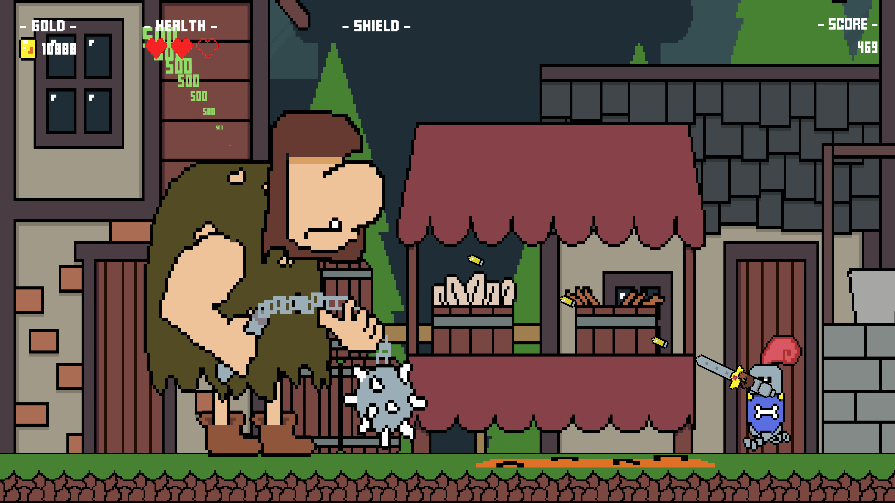
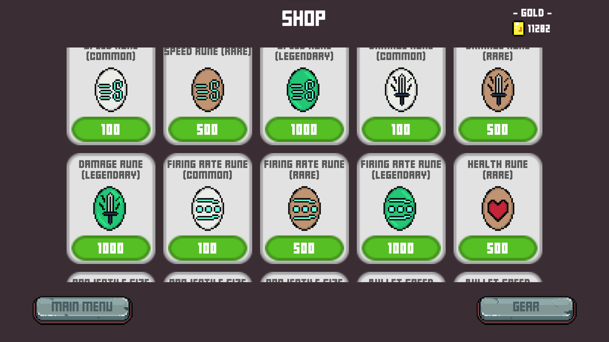
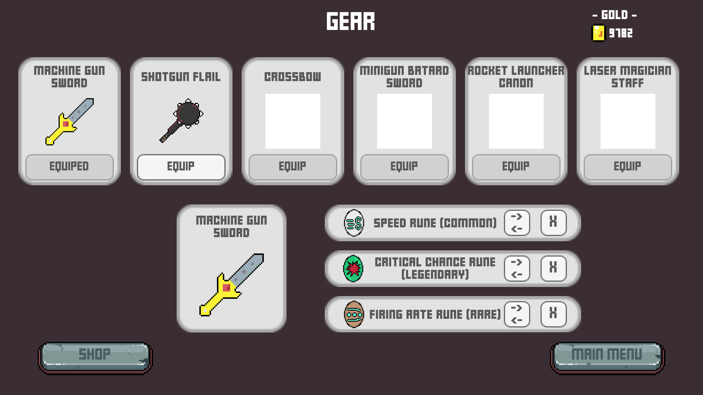
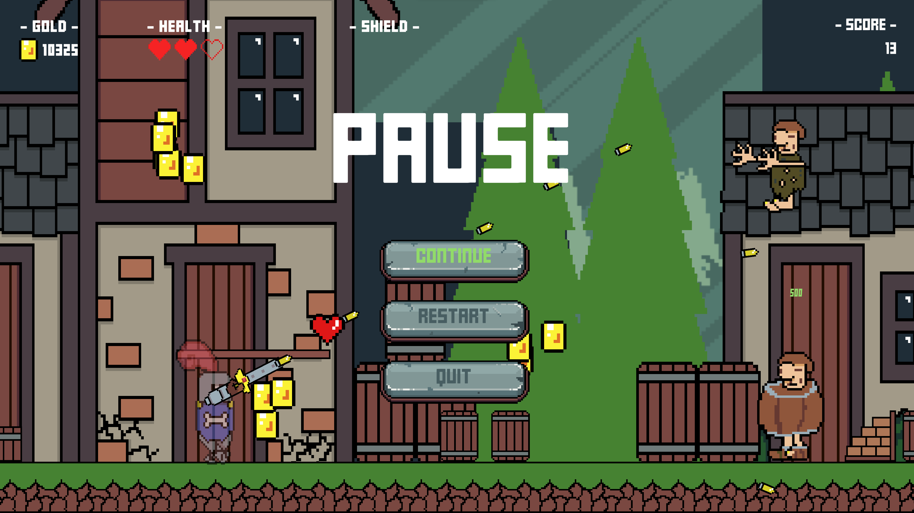
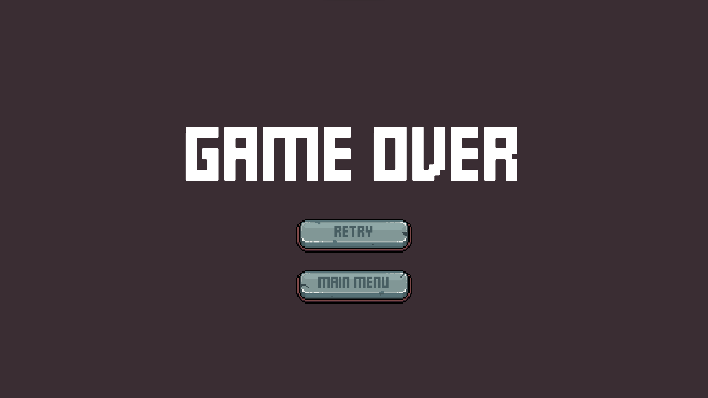
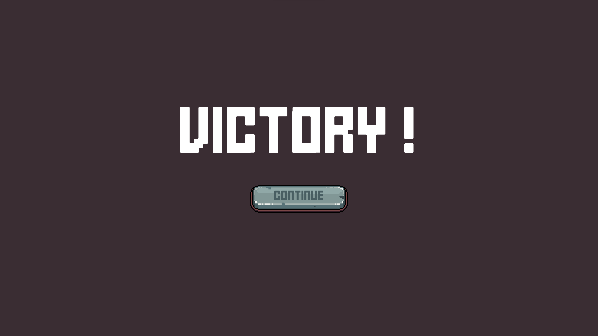
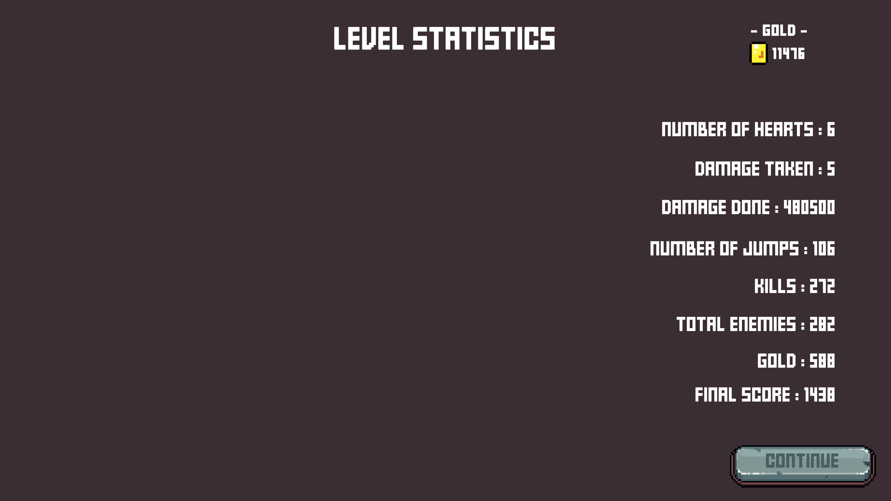
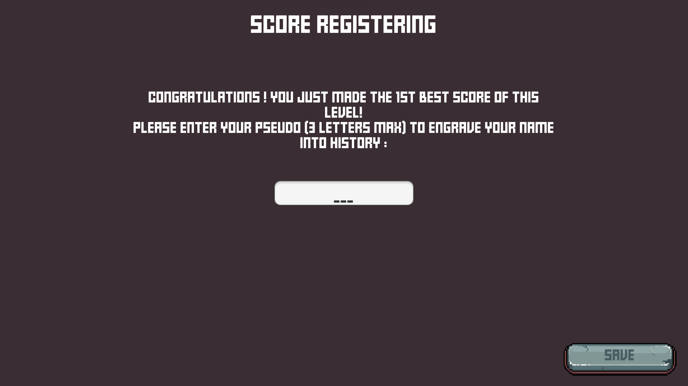
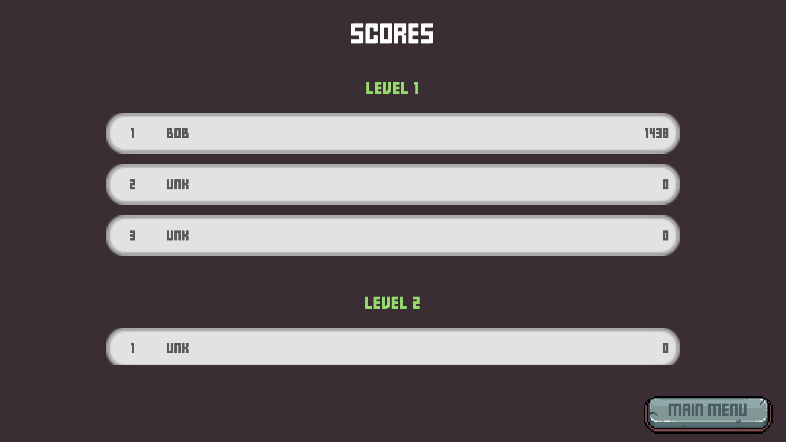